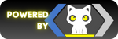

# Portal Rex


#



## Descrição

O Portal Rex é o ponto de acesso centralizado para todos os serviços oferecidos pela empresa Rex. Este portal foi desenvolvido para simplificar o acesso aos diversos serviços especializados que a empresa oferece, cada um com seu próprio domínio exclusivo.

### Serviços Oferecidos:

- **[Rexlift](https://www.rexlift.com.br)**: Especializado em soluções de elevação e movimentação de cargas.
- **[RexCoworking](https://www.rexcoworking.com.br)**: Coworking do Mecânico, oferecendo infraestrutura completa para profissionais automotivos.
- **[RexCustoms](https://www.rexcustoms.com.br)**: Focado na customização de veículos e projetos exclusivos.
- **[Rex Performance](https://www.rexperformance.com.br)**: Performance automotiva de alta qualidade, aprimorando veículos para alta performance.
- **[Rex Motors](https://www.rexmotors.com.br)**: Venda de veículos exclusivos e customizados, além de carros clássicos.
- **[Acha Ruídos](https://www.acharuidos.com.br)**: Serviço especializado em diagnóstico de ruídos automotivos.

## Tecnologias Utilizadas

<div align="center">

<table style="width: 100%; table-layout: fixed;">
  <tr>
    <td align="center" style="width: 33.33%; vertical-align: top;">
      <div style="display: flex; justify-content: center;">
        
      </div>
      <br /><strong>HTML5</strong><br />Estrutura do site.
    </td>
    <td align="center" style="width: 33.33%; vertical-align: top;">
      <div style="display: flex; justify-content: center;">
        
      </div>
      <br /><strong>CSS3</strong><br />Estilização do site.
    </td>
    <td align="center" style="width: 33.33%; vertical-align: top;">
      <div style="display: flex; justify-content: center;">
        
      </div>
      <br /><strong>Bootstrap 5.3</strong><br />Framework CSS utilizado para responsividade e componentes da interface.
    </td>
  </tr>
  <tr>
    <td align="center" style="width: 33.33%; vertical-align: top;">
      <div style="display: flex; justify-content: center;">
        
      </div>
      <br /><strong>JavaScript</strong><br />Funcionalidades interativas no site.
    </td>
    <td align="center" style="width: 33.33%; vertical-align: top;">
      <div style="display: flex; justify-content: center;">
        
      </div>
      <br /><strong>Bootstrap Icon</strong><br />Ícones usados no site.
    </td>
    <td align="center" style="width: 33.33%; vertical-align: top;">
      <div style="display: flex; justify-content: center;">
        
      </div>
      <br /><strong>Git</strong><br />Controle de versão.
    </td>
  </tr>
</table>

</div>

## Instalação

1. Clone o repositório:
    ```bash
    git clone https://github.com/foliveiradark/portal_rex.git
    ```

2. Navegue até o diretório do projeto:
    ```bash
    cd portal_rex
    ```

3. Abra o projeto em seu navegador.

## Uso

Para acessar o portal, abra o arquivo `index.html` em um navegador de sua escolha. A partir do portal, você poderá acessar os diversos serviços oferecidos pela Rex.

## Contribuição

Se você deseja contribuir para este projeto, por favor, abra um Pull Request com suas alterações. Certifique-se de seguir as diretrizes de contribuição.

## Licença

Este projeto está licenciado sob a Licença MIT. Veja o arquivo [LICENSE](LICENSE) para mais detalhes.


